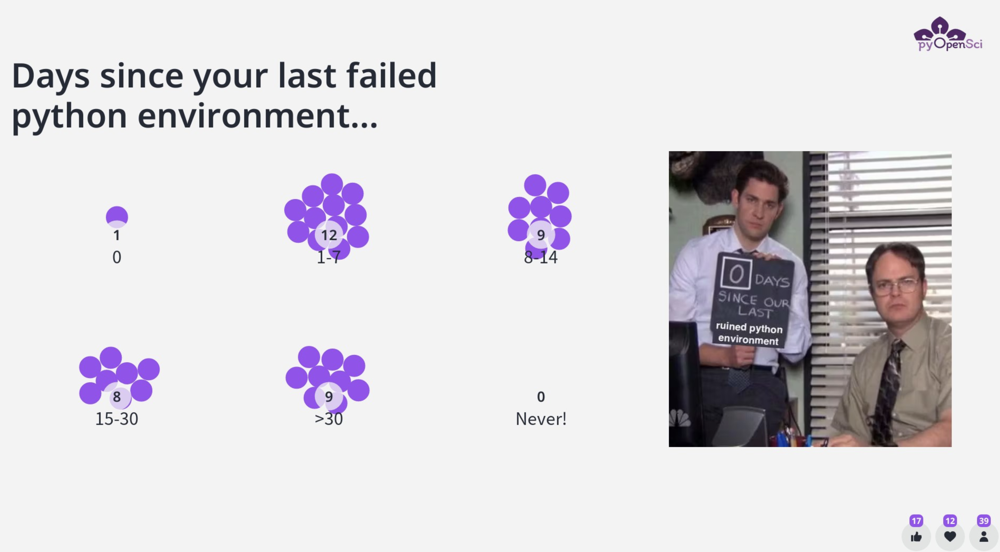

## Intro

- was my first time attending the RSE meeting
- was great to get to know this dynamic and growing community

I lead a Bof Session in the 2023 eeting thisyear.
If you don't know a BoF stands for Birds ofa feather.
BoF sessions are informal community gatherings around a specific topic. is provides a chance for the community to engaged with each other, ask question, get involved.

In our case talking about pyopensci and the work we are doing to

1. peer review of software
2. python packaging resources and guidelines for python packaging.
3. trianing and mentorship to try to diversify who is particpating in open source

## pyOpenSci BoF by the numbers

We used mentimeter to drive an engaging and interactive session.
What is fun about this specific tool is it allowed me to capture feedback from the audeince in several forms. All of which i'l try to summarize for you here.

We had approximately 50 people attend our 1.5 hour bof

- i spent about 1 hour after the bof answering questions and talking to folks about all things python open source
- some of that discussion bled into dinner after where i spoke with one of our community partners, Nabil from sunpy

It was an engaging and vibrant session. check out the slides below:

<iframe sandbox='allow-scripts allow-same-origin allow-presentation' allowfullscreen='true' allowtransparency='true' frameborder='0' height='315' src='https://www.mentimeter.com/app/presentation/alscm41q425ntc16f4ontr4p4qvg2ii6/embed' style='position: absolute; top: 0; left: 0; width: 100%; height: 100%;' width='420'></iframe>

In our bof, i introduced the three core programs that pyOpenSci currently runs which are:

1. Open peer review of scientific Python software
2. Community driven packaging resources
3. Mentorship and training to diversify our ecosystem

### Days since your last python environment broke

One of our community members, Isabel, suggested a great icebreaker question : how long has it been since you had a broken Python environment.

It is no surprise that most pythonistas regularly deal with
environment challenges.

So if you've been in this boat too, you are are not alone!

<figure>
    
    <figcaption>Add caption.
    </figcaption>
</figure>

Full disclosure the one person who voted for 0 days, admitted to the fact that they hadn't used python in the past month :)

## How is pyOpenSci different from JOSS?

One of the most common questions I get is:

> What is the difference between pyOpenSci and JOSS?

The short answer to this is that our organizations have different,
but complementary goals. Hence our partnership.

JOSS's core goal is to provide the critical academic credit to software maintainers for developing tools. As such they are a publisher and publication is an end-point for a maintainer. Once a package is published in JOSS, it gains a CROSS-REF doi which is citable and attached to your ORCID-id.

pyOpenSci's core goal is to support maintainers through the process of both developing and maintaining software. We also care about long term maintenance of software. As such, once accepted into our ecosystem, pyOpenSci package maintainers become an integral part of our community. pyOpenSci will build relationships with them. And we will watch tools over time to ensure tools in our growing catalog are maintained over time.

**Note:** Another difference is that our scope is different...
{: .notice }

If they become unmaintained we will either archive / sunset the project in our catalog and/or try to help find a new maintainer for hte tool.

### pyOpenSci-JOSS partnership for the win

Through our partnership with JOSS, a maintainer can both get
support and contribute back to the growing pyOpenSci community. But they can also receive the software publication and associated academic credit that is so important.

## pyOpenSci's partnership program with domain-specific software communities

our partnership program was of interest to the community (link to new page??)

- we have a partnership program where we add an additional layer to our review where a package can become both a

1. part of our ecosystem
2. published by JOSS
3. an affiliated package for pyopensci

Some of the communities that we are currently speaking with...

<figure>
    
    <figcaption>Add caption.
    </figcaption>
</figure>

Questions we received around our partner community program

### Can a package that doesn't make the affiliated "standard" and is thus rejected from a partnership community or a package that doesn't want to go through JOSS< only pyOpenSci still become a part of the community?

The answer to that is YES and yes. just because a package is submitted to pyOpenSci doesn't mean you HAVE to move forward with a publication. Further if your tool doesn't make the affiliated package cut, you can still be accepted into the pyOpenSci ecosystem

in that regard it's a win-win situation for maintainers so submit to us regardless of their goals associated with JOSS or becoming an affiliated package with a partner community.

## Community-driven packaging resources

## What is an RSE?

this might be a second shorter blog about this career path

- definition
-

## Why are these positions critical to academia

## how do rse's fit into the traditional academic environments

Some of my take aways from this meeting were:

- in this meeting lots of momentum around energy for RSE's in academic as paid positions.
  \*some schools like princenton run RSE programs (link to programs)
- other schools are have less recognization of this critical role. RSEs are in IT groups rather than being embedded within the departmetns.

\*Issues of funding which is difficult when a lab is run on a grant-by-grant basis...

At the end of the day this RSE community is clearly critical to support the openscience community - however more work needs to be done to promote change in academic institutions which often seem to follow older older models...

## How to get involved with the RSE movement

- US RSE.org... link to website
  attend next year's meeting in albequiere ,
